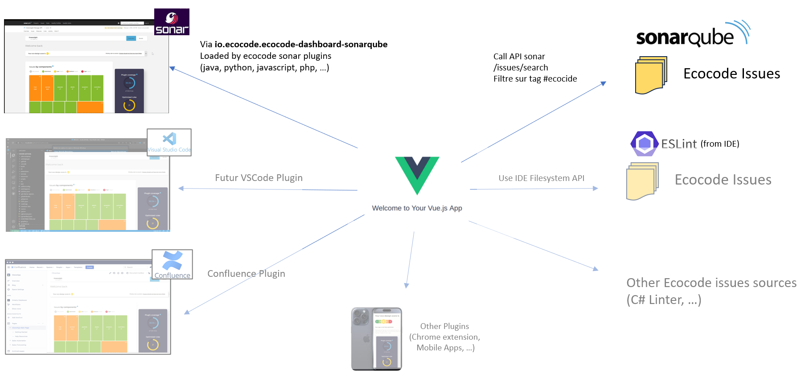
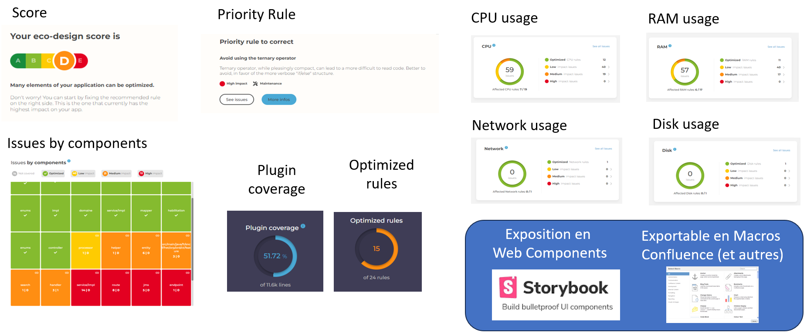

# EcoCode-Dashboard

This project is meant to provide Sustainable Code Dashboards to 
- show potential impact on sustainability of unffollowed recommendations
- help decisions regarding code enhancement priorisation 
- and even potentially prevent new issues to be pushed to production

## Open Architecture 

This project starts as a Vue.js application
- made available as a Sonarqube extension page 
- related to the sonar inspected project using the sonarqube web APIs

Still, the code is structured to remain product agnostic
- allowing dashboards to be integrated in other contexts like
    - IDE addons for developers (VSCode, WebStorm, Visual Studio, Android Studio, X-Code, ...)
    - CI Pull/Merge Requests (Bitbucket, Github, Gitlab, Azure Devops, Gerrit, ...)
    - Project Wikis for decision makers (Confluence, Github/Gitlab, Teams/Sharepoint, Azure Devops, ...)
    - Or even dedicated Apps/Webapps (iOS, Android, ...)
- allowing to retrieves issues from other sources than the sonarqube API like
  - Other Static code  analyses solutions (Github, Codacy, Qodana, ...)
  - Linter reports (ESLint, csslint, klint, speccy/spectral, PHPStan, pylint, sqlfluff, ...)



## Open and testable Widget Catalog

The Dashboard are constructed from widgets (web components) exposed to storybooks.

It allows:
- to individually develop, enhance and test those widgets (accessibility, behaviors, visual regression)
- to ultimately help having stable end-to-end tests with gherkin step-definitions provided by these components themselves
- to be able to provide on-demand dashboards or dedicated widgets in any end application contexts (ex: independant Confluence macros)




## Project Build and Start

```sh
pnpm ci
```

Prefer `pnpm` for a faster and more secure installation with less network and disk space usage.

### Compile and Minify for Production

```sh
npm run build
```

### Run Unit Tests with [Vitest](https://vitest.dev/)

```sh
npm run test:unit
```

### Run End-to-End Tests with [Playwright](https://playwright.dev)

```sh
# Install browsers for the first run
npx playwright install

# Install Playwright dependencies to run browsers
sudo apt-get install libgbm1 # for chrome
sudo apt-get install libgtk-3-0 # for firefox

# When testing on CI, must build the project first
npm run build

# Runs the end-to-end tests
npm run test:e2e
# Runs the tests only on Chromium
npm run test:e2e -- --project=chromium
# Runs the tests of a specific file
npm run test:e2e -- tests/example.spec.ts
# Runs the tests in debug mode
npm run test:e2e -- --debug
```

### Lint with [ESLint](https://eslint.org/)

```sh
npm run lint
```
